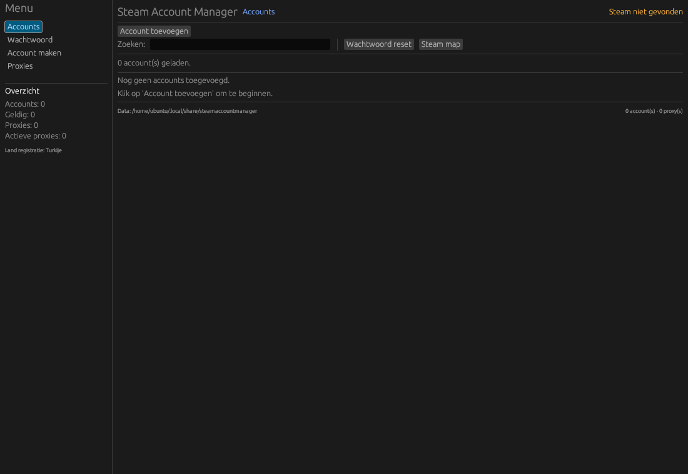
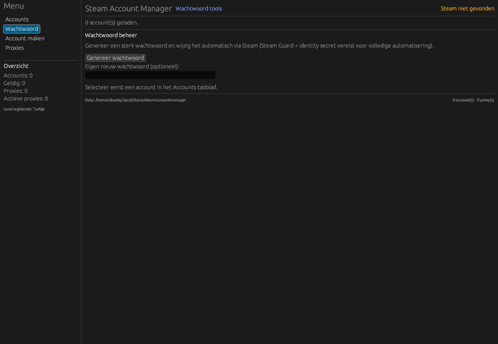
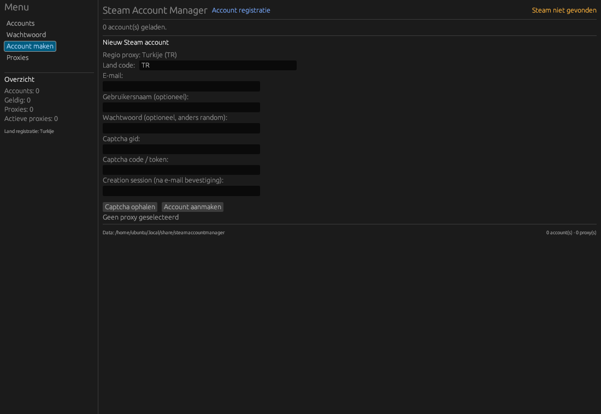
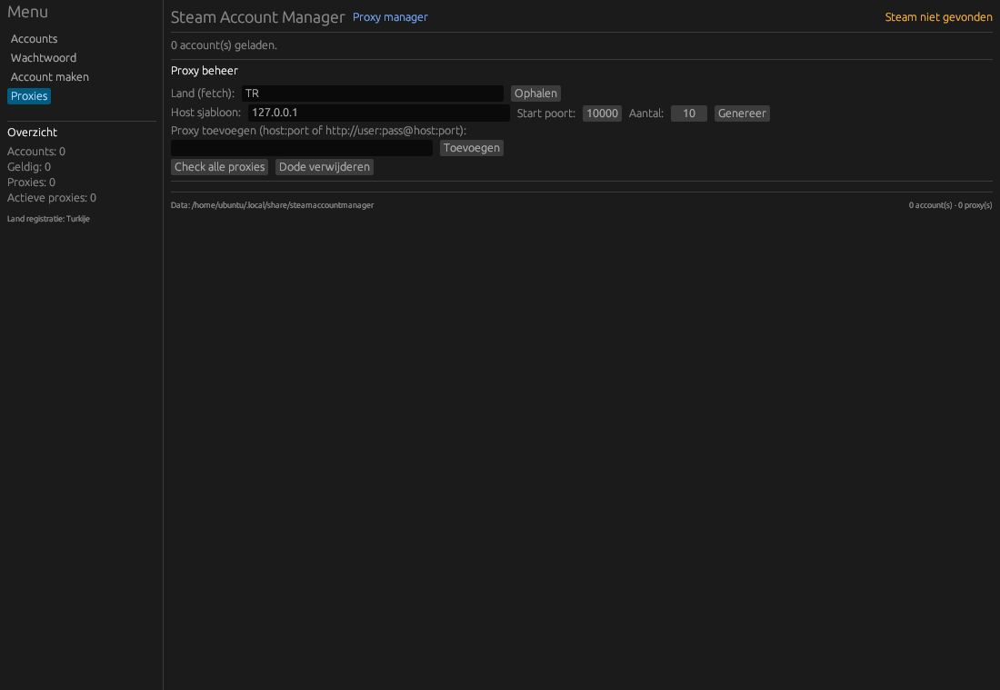

# Steam Account Manager

Simple & Lightweight - Steam Account Manager

Een Rust desktop applicatie met egui/eframe voor het beheren van meerdere Steam accounts.

<p align="center">
  
</p>

## Features

### Accounts
- Toevoegen, bewerken, verwijderen en zoeken
- Automatische validatie via Steam API
- Inloggen met Steam client switch
- Steam Guard (e-mail, authenticator, mobiele bevestiging)
- Auto Guard codes via shared secret
- Versleutelde lokale opslag (AES-256-GCM)

### Wachtwoord tools
- Genereer sterke wachtwoorden
- Automatisch wachtwoord wijzigen via Steam Help wizard
- Auto Steam Guard / mobiele bevestiging met identity secret

<p align="center">
  
</p>

### Account registratie
- Steam account aanmaken via store API
- Proxy per registratie (bijv. TR voor Turks account)
- Captcha ophalen en e-mail verificatie flow

<p align="center">
  
</p>

### Proxy manager
- Proxies handmatig toevoegen
- Ophalen per land (proxyscrape)
- Lokaal genereren (host + poort range)
- Check alive + latency + IP

<p align="center">
  
</p>

## Bouwen

```bash
cargo build --release
cargo run --release
```

Windows release: [GitHub Releases](https://github.com/aangeraakt/Steam-Account-Manager/releases)

## Tests

Headless testsuite voor alle feature-logica (43 tests). Zie [TESTING.md](TESTING.md).

```bash
cargo test
```

## GUI

| Tab | Beschrijving |
|-----|--------------|
| **Accounts** | Accountlijst, zoeken, inloggen, valideren |
| **Wachtwoord** | Wachtwoord genereren en automatisch wijzigen |
| **Account maken** | Registratie met captcha en proxy |
| **Proxies** | Ophalen, genereren, checken en beheren |

Sidebar toont live statistieken (accounts, proxies, registratieland). Modale vensters voor Steam Guard en account CRUD.

## Disclaimer

Niet geaffilieerd met Valve Corporation. Gebruik in overeenstemming met de Steam Subscriber Agreement.
