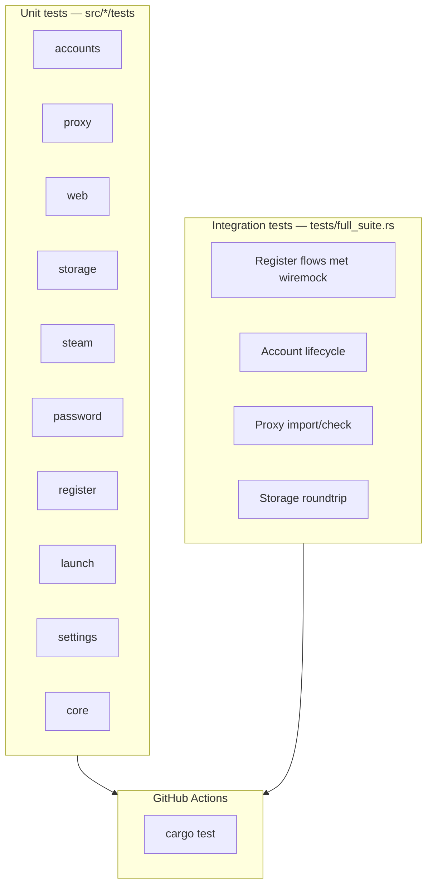

# Headless test suite

Deze applicatie heeft een volledige headless testsuite die **alle feature-logica** test — niet alleen of de app start.

## Snel starten

```bash
cargo test
```

Met extra output:

```bash
cargo test -- --nocapture
```

CI draait `cargo test --verbose` bij elke push en pull request.

---

## Architectuur



### Lib + bin split

| Bestand | Rol |
|---------|-----|
| `src/lib.rs` | Publieke modules voor tests |
| `src/main.rs` | Alleen GUI entrypoint |
| `src/core.rs` | Businesslogica los van egui |

### Test hooks

| Hook | Gebruik |
|------|---------|
| `WebClient::with_test_host()` | HTTP naar wiremock i.p.v. Steam |
| `STEAM_TEST_HOST` env var | Optionele host override |
| `SecureStorage::with_paths()` | Isolated storage in temp dir |
| `fetch_captcha_at()` / `create_account_at()` / `verify_email_at()` | Register tests met mock server |

---

## Wat wordt getest

### Accounts (`src/accounts.rs`)

- CRUD op `AccountStore`
- Sorteren op display name
- Zoeken/filter op username, alias, persona, steam ID
- Status labels (Nederlands)

### Core / app state (`src/core.rs`)

- Account form validatie (username + wachtwoord verplicht)
- Account bouwen/updaten vanuit form
- Register form validatie (e-mail + captcha)
- Register request opbouwen
- Overview statistieken
- Gefilterde accountlijst
- Proxy toevoegen, import, health, dode proxies verwijderen
- Worker outcomes: validate, login, password changed, register success
- Account verwijderen

### Storage (`src/storage.rs`)

- AES-256-GCM encrypt/decrypt roundtrip
- Lege load bij ontbrekend bestand
- Migratie oude `AccountStore` formaat

### Proxy (`src/proxy.rs`)

- Parse: `http://`, `https://`, `socks5://`, auth, bare host:port
- Ongeldige regels afwijzen
- Lokaal genereren (host + poort range)
- Display string met label

### Register (`src/register.rs` + integration)

- Land labels (TR, NL, DE, …)
- Captcha ophalen (gemockt)
- E-mail verificatie → creation session (gemockt)
- Account aanmaken (gemockt)

### Password (`src/password.rs`)

- Auth cookies bouwen voor Help wizard
- Afwijzen wanneer nieuw wachtwoord = huidig wachtwoord

### Steam (`src/steam.rs`)

- Profiel XML parsen (persona + avatar)
- Guard type labels en input requirements
- Auth result toepassen op account
- Ongeldige shared secret afwijzen

### Launch (`src/launch.rs`)

- `loginusers.vdf` bijwerken (MostRecent flag)
- Steam executable detectie (platform-afhankelijk)

### Web (`src/web.rs`)

- Sterk wachtwoord generator (lengte + character classes)
- Session ID generatie
- Query parameter parsing
- Cookie handling op client

### Settings (`src/settings.rs`)

- Default waarden (TR land, proxy template, start poort)

---

## Integration tests (`tests/full_suite.rs`)

| Test | Feature |
|------|---------|
| `register_fetch_captcha_uses_store_api` | Captcha ophalen |
| `register_verify_email_returns_creation_session` | E-mail verify flow |
| `register_create_account_full_flow` | Account aanmaken |
| `core_account_lifecycle_*` | Validate, password, delete, overview |
| `core_proxy_import_check_and_cleanup` | Proxy import + health |
| `encrypted_storage_roundtrip_via_temp_paths` | Versleutelde opslag |
| `apply_register_success_adds_account_to_store` | Register → account lijst |
| `web_client_hits_rewritten_test_host` | HTTP client rewrite |
| `test_agent_reports_feature_coverage` | Feature checklist |

Totaal: **43 tests** (32 unit + 11 integration).

---

## Wat niet headless getest wordt

| Feature | Reden | Mogelijke oplossing |
|---------|-------|---------------------|
| Echte Steam login | Live Steam API + credentials | Nightly job met `STEAM_TEST_*` secrets |
| Steam client launch | `steam.exe`, registry, VDF op Windows | Windows CI runner |
| GUI (egui) klikken | Native desktop, geen webdriver | Logica via `core` module |
| Captcha oplossen | Menselijke input | Mock API responses (al gedaan) |
| Proxy fetch live | Externe proxyscrape API | `#[ignore]` smoke test |

---

## Nieuwe tests toevoegen

### Unit test in module

```rust
#[cfg(test)]
mod tests {
    use super::*;

    #[test]
    fn my_test() {
        assert!(true);
    }
}
```

### Integration test met wiremock

```rust
#[tokio::test]
async fn my_api_test() {
    let server = MockServer::start().await;
    Mock::given(method("GET"))
        .and(path_regex(r"/endpoint/?.*"))
        .respond_with(ResponseTemplate::new(200).set_body_json(serde_json::json!({
            "ok": true
        })))
        .mount(&server)
        .await;

    let result = my_function_at(None, Some(&server.uri())).await.unwrap();
    assert!(result.ok);
}
```

### Live Steam test (optioneel)

```rust
#[tokio::test]
#[ignore]
async fn live_steam_validate() {
    // Vereist STEAM_TEST_USER en STEAM_TEST_PASS env vars
}
```

Draai ignored tests:

```bash
cargo test -- --ignored
```

---

## CI

In `.github/workflows/ci.yml`:

```yaml
- name: Run test suite
  run: cargo test --verbose
```

Volgorde: `fmt` → `clippy` → `test` → `build release`.

---

## Bestandsstructuur

```
src/
  lib.rs          # Module exports
  core.rs         # Testbare businesslogica
  accounts.rs     # + unit tests
  proxy.rs        # + unit tests
  web.rs          # + unit tests
  storage.rs      # + unit tests
  steam.rs        # + unit tests
  password.rs     # + unit tests
  register.rs     # + unit tests
  launch.rs       # + unit tests
  settings.rs     # + unit tests
  app.rs          # GUI (gebruikt core)
  main.rs         # Binary entry

tests/
  full_suite.rs   # Integration / feature tests
```
